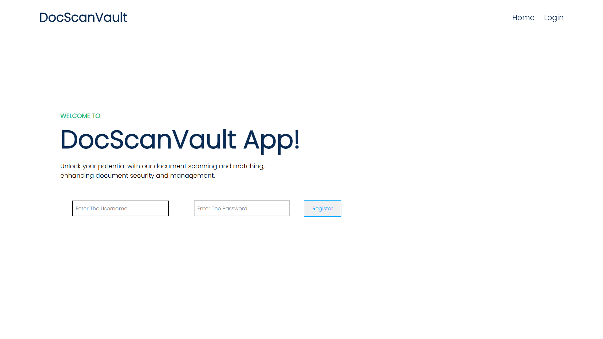
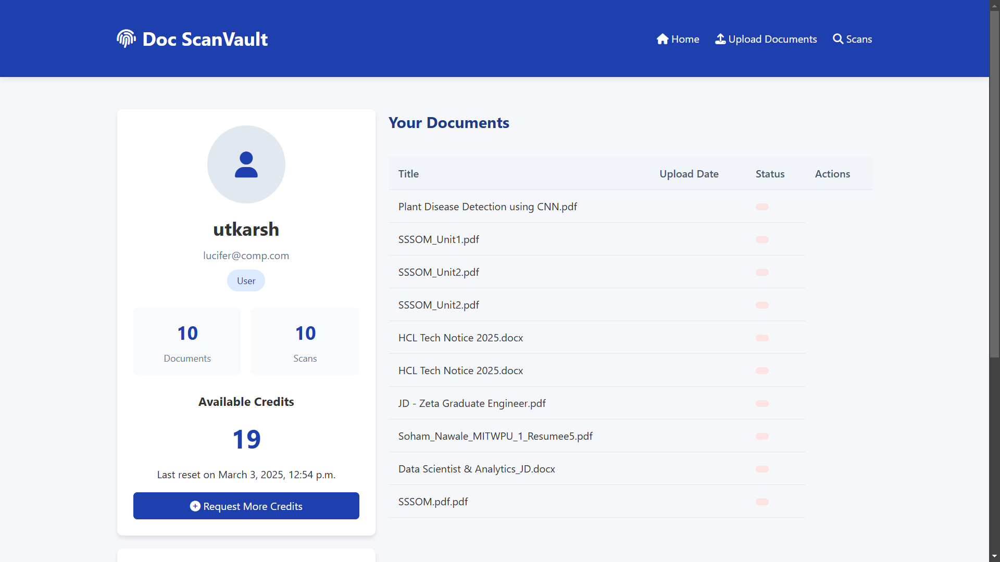

# DocScanVault
Doc ScanVault is a web application designed to manage and analyze documents. It allows users to upload documents, check for similarities, and manage their account credits

## Features

* **User Authentication:** Secure registration and login functionality.
* **Document Upload:** Users can upload documents in various formats (PDF, DOCX, etc.).
**Credit Management:** Users have a credit balance for scanning documents.
**Metadata Storage:** Stores and manages document metadata

## Technologies Used
**Backend:** Django (Python)
 **Database:** (Configurable; SQLite by default)
 **Frontend:** HTML, CSS, JavaScript (Basic implementation provided)
 **Hashing:** hashlib (for document content hashing)

 # Installation
 1.  **Clone the Repository:**
 git clone https://github.com/Sohamnawale/DocScanVault.git

 # 2.Install dependencies
  pip install -r requirements.txt

 # 3. Run the application
 python manage.py startapp Doc_ScanVault
 python manage.py runserver

 ## Usage
 1.  **Register:** Go to the registration page and fill out the form with your details
 2.  **Login:** Use your credentials to log in to the application
 3.  **Upload Document:** Click on the "Upload Document" button and select the file
 4. **Manage Credits:** View and manage your account credits
 5. **View Metadata:** View and manage document metadata
 6. **View Profile** : View your profile information

 

 

